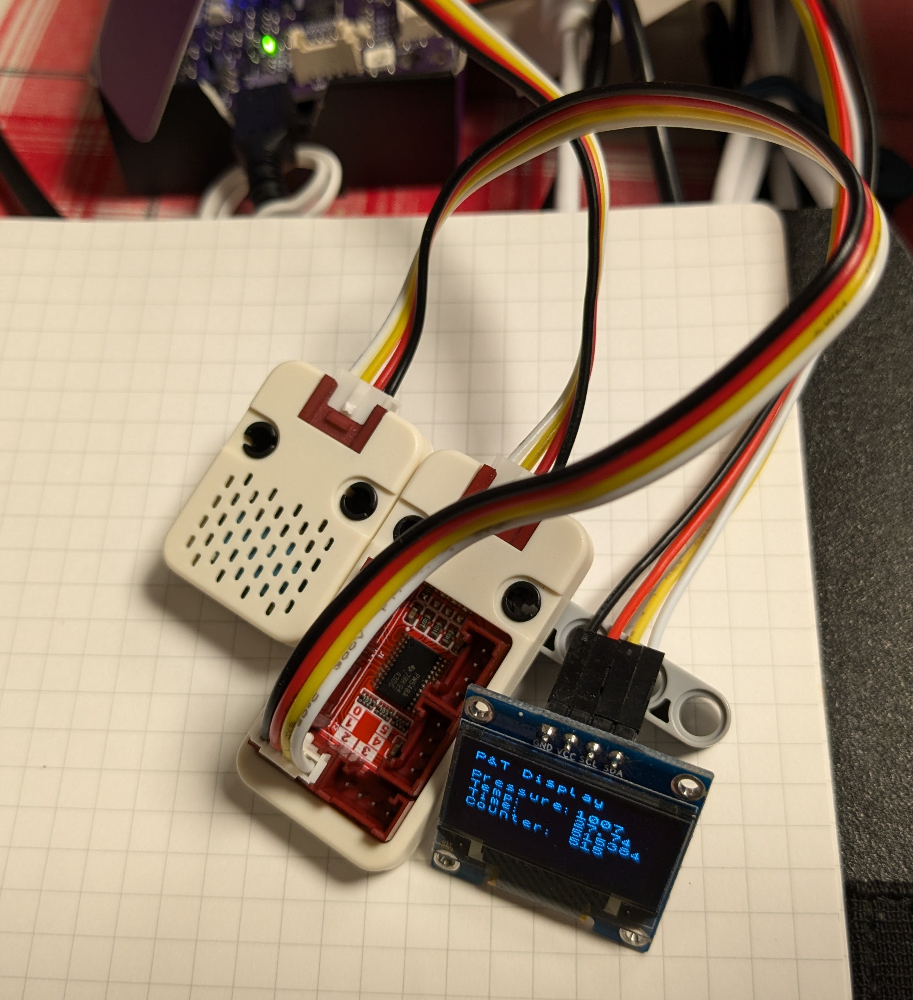

# Embedded Rust and Embassy and a PCA9548A I2C Multiplexer

PCA9548A test

## Hardware Requirements

* RP2040. I use a Cytron Maker Pi RP2040.
* RPi Pico Probe for downloading and status messages from the RP2040
* I2C SSD1306 OLED display (128x64 pixel)
* PCA9548A connected to a 
* BMP280 for pressure and temperature

## Software Requirements

* Install target compiler:

```
$ rustup target add thumbv6m-none-eabi
```

* To use the Pico probe:

```
$ cargo binstall probe-rs
```

* To use various tools, e.g. to see the code size of the generated ELF (e.g. `cargo size`):

```
$ cargo binstall cargo-binutils
$ cargo size --release
    Finished `release` profile [optimized + debuginfo] target(s) in 0.05s
   text    data     bss     dec     hex filename
  33324       0  104024  137348   21884 rp-bmp280
```

## Running it

The OLED is connected to I2C0 (GPIO 4 and 5). The PCA9548A is connected to I2C1 (GPIO 2 and 3).
The BMP280 is connected to bus 2 of the PCA9548A.



Special thanks to [Phosfor](https://github.com/Phosfor) for helping me understand how his pca9548a crate works
and what needed to be changed to compile it using no_std and Embassy.
